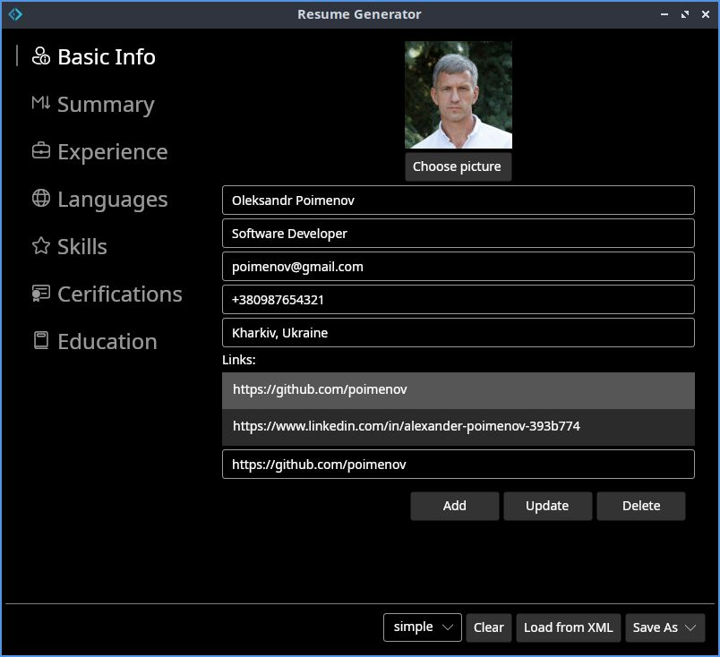

# Resume

Script screen:



## Description

Resume creation script/application 

### Prerequisites

.Net 10.0 SDK

### Run

To run as script:

```bash
cd resume
dotnet fsi resume.fsx
```
To run as application:

```bash
cd resume
dotnet run
```

Since the photo on your resume is displayed at 120 x 120 pixels, there's no point in using a larger image, and it will save you file size.

PDF generation takes some time
